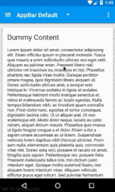

Material AppBar Skeleton
========================
AppBar Skeleton Demo with Material Design libraries to support quick implementations of Toolbar Styles.

Default AppBar
--------------


Configuration
-------------
Layout file for Default AppBar is located on */res/layout/activity_appbar_default.xml*

You'll notice I'm wrapping the layout with the new *CoordinatorLayout* component.

You just need to add inside the *CoordinatorLayout* this *AppBarLayout & Toolbar* xml:

XML
-------
```xml
<android.support.design.widget.CoordinatorLayout
    xmlns:android="http://schemas.android.com/apk/res/android"
    xmlns:app="http://schemas.android.com/apk/res-auto"
    android:layout_width="match_parent"
    android:layout_height="match_parent">
    
    <!-- Your content should go here -->
    
    <android.support.design.widget.AppBarLayout
            android:id="@+id/appbarLayout"
            android:layout_width="match_parent"
            android:layout_height="wrap_content"
            android:fitsSystemWindows="true"
            android:theme="@style/ThemeOverlay.AppCompat.Dark.ActionBar">
    
            <android.support.v7.widget.Toolbar
                android:id="@+id/toolbar"
                android:layout_width="match_parent"
                android:layout_height="wrap_content"
                android:background="?attr/colorPrimary"
                android:elevation="@dimen/appbar_elevation_size"
                android:minHeight="?attr/actionBarSize"
                app:popupTheme="@style/ThemeOverlay.AppCompat.Light"
                app:theme="@style/ThemeOverlay.AppCompat.Dark.ActionBar"
                app:layout_scrollFlags="scroll|enterAlways"/>
                
    </android.support.design.widget.AppBarLayout>
    
</android.support.design.widget.CoordinatorLayout>
```


CoordinatorLayout Properties
----------------------------

>For Default AppBar interactions:

*You must apply this attribute on the Toolbar component!*

* `app:layout_scrollFlags="scroll"` Our Toolbar will slide up when you scroll up content, and it will slide down when it returns to initial scroll position.
* `app:layout_scrollFlags="scroll|enterAlways"` Our Toolbar will slide up when you scroll up content, and it will slide down immediately when you start scrolling down.
